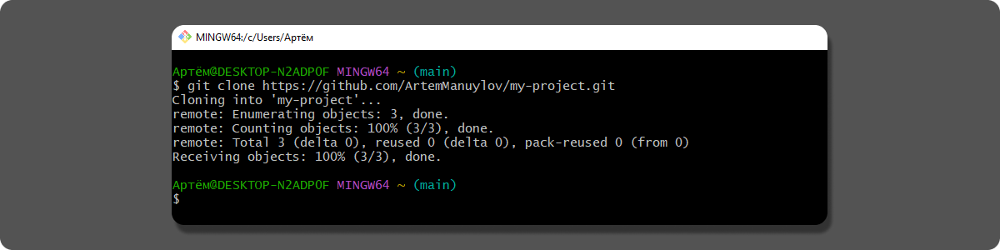
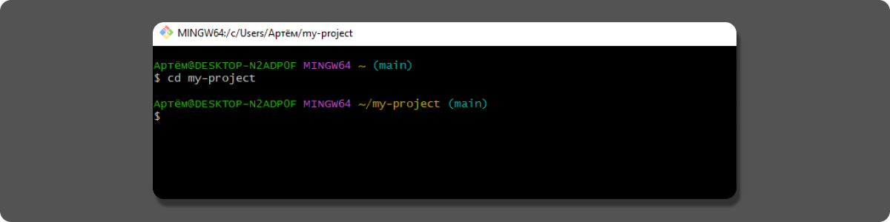
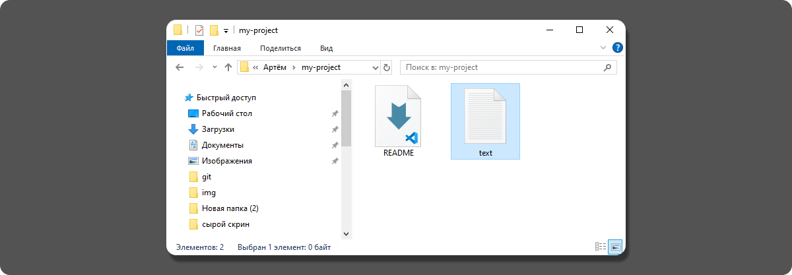
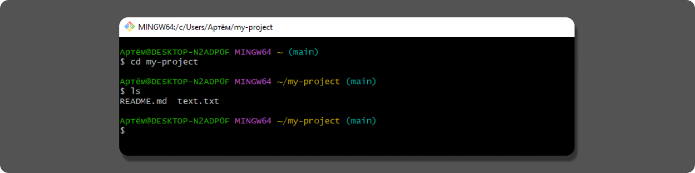
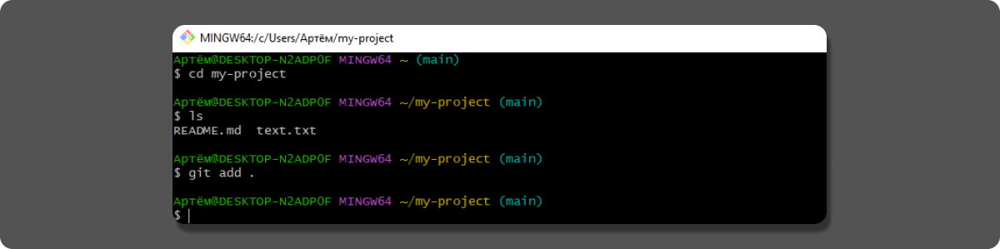
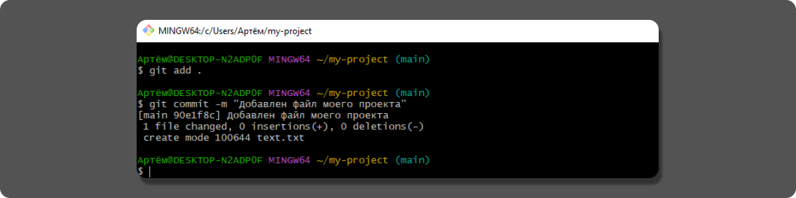
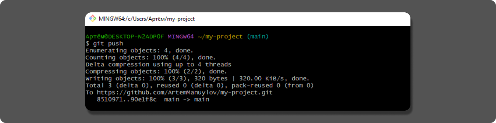
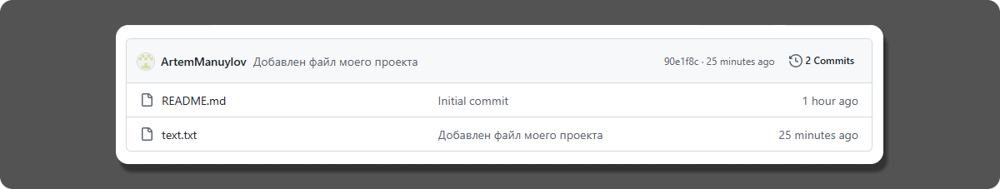

##  Перенос проекта в репозиторий GitHub через клонирование 

Данный метод предполагает первоначальное клонирование удаленного репозитория с GitHub на ваш компьютер с последующим переносом в него файлов из локального проекта. Этот подход обеспечивает правильную связь с удаленным репозиторием и сохранение всех служебных файлов GitHub.

1. **Найдите ссылку на вашем репозитории GitHub**
   
   * Откройте ваш репозиторий на GitHub.
   * Нажмите кнопку `<> Code`.
   * Скопируйте ссылку из раздела HTTPS.
  
   

2. **Скачайте репозиторий на компьютер**
   
   Откройте терминал (командную строку) и выполните:

   ```bash
    git clone ВАША-СКОПИРОВАННАЯ-ССЫЛКА
   ```
   После этой команды на вашем компьютере появится новая папка с названием вашего репозитория.

   

3. **Перейдите в скачанную папку**
  
   В терминале выполните:

   ```bash
   cd название-вашего-репозитория
   ```
   После этой команды терминал переведет Вас в скачанную папку.

   

4. **Скопируйте ваши файлы проекта**

   * Откройте папку с вашим проектом.
   * Откройте скачанную папку из GitHub.
   * Скопируйте ВСЕ файлы из вашего проекта в папку GitHub.
  
   

5. **Проверьте скопированные файлы**

   В терминале выполните:

   ```bash
   ls
   ```

   Вы должны увидеть все ваши скопированные файлы проекта.

   

6. **Добавьте файлы в Git**
   
   В терминале выполните:


   ```bash
   git add .
   ```
   Эта команда добавляет все новые файлы под контроль Git.

   

7. **Сохраните изменения (создайте коммит)**
   
   В терминале выполните:

   ```bash
   git commit -m "Добавлен файл моего проекта"
   ```
   Эта команда сохранит изменения и создаст сообщение коммита.

   

8. **Отправьте файлы на GitHub**
   
   В терминале выполните:

   ```bash
   git push
   ```
   Эта команда отправит файлы на удаленный репозиторий на GitHub.

   

9. **Проверьте результат**
   
   * Вернитесь на страницу вашего репозитория на GitHub.
   * Обновите страницу.
   * Убедитесь, что все ваши файлы появились.
   
   