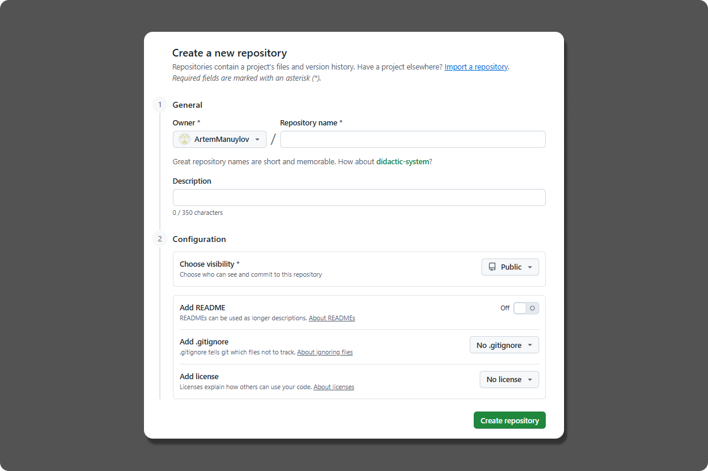

## Создание удаленного репозитория

1. **Переход к созданию удаленного репозитория**

   * В правом верхнем углу нажмите на значок `+`,
   * В выпадающем меню выберите `New repository`.
  
    

    Откроется окно создания нового репозитория.

2. **Заполнение основной информации и создание удаленного репозитория**
   
   Обязательные поля:

   * **Repository name** —  Имя репозитория;
   * **Visibility** —  Тип доступа.
  
     * **Public** —  виден всем;
     * **Private** —  только для вас.
   
   Дополнительные настройки: 

   *  **Description** —  поле ввода краткого описания проекта;
   *  **Add a README file** —   создать файл с описанием проекта;
   *  **Add .gitignore** —  шаблон для исключения файлов (выберите ваш язык/технологию);
   *  **Choose a license** —  лицензия проекта.
  
   Создание репозитория: 

   * Нажмите зеленую кнопку `Create repository`.

   
  
   Система создаст ваш первый удаленный репозиторий.